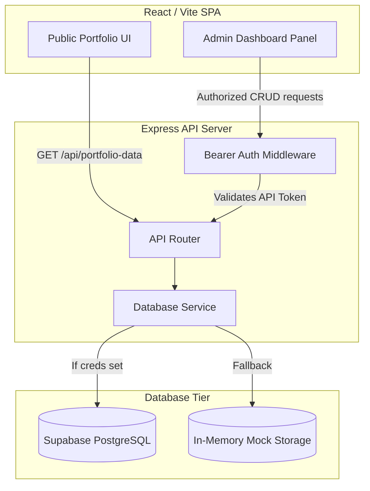

# Dynamic Personal Portfolio with Supabase Integration

A modern, high-performance, and feature-rich full-stack web application designed to showcase and dynamically manage professional credentials. The application features a dynamic public portfolio page with rich visuals, responsive typography, and an interactive **Admin Dashboard** allowing you to manage database contents in real-time.



---

## 🛠️ Tech Stack

### Frontend
- **Framework**: React 19 (Vite)
- **Styling**: Tailwind CSS v4, Glassmorphism, CSS Variables
- **Animations**: Framer Motion
- **Scroll engine**: Lenis Smooth Scroll
- **Icons**: Lucide React

### Backend
- **Framework**: Express (Node.js)
- **Logging**: Morgan
- **Database client**: Supabase-JS
- **Process Manager**: Nodemon (for development)

### Database
- **Database**: PostgreSQL (hosted on Supabase)
- **In-memory**: In-memory javascript objects fallback when Supabase is unconfigured.

---

## 🗄️ Database Schema

The database uses PostgreSQL. The schema structure defined in [schema.sql](file:///Users/saif/.gemini/antigravity-ide/scratch/dynamic-portfolio/schema.sql) is as follows:

### 1. `site_config`
Manages general configuration, global typography, themes, and hero section copywriting.
- `id` (INTEGER, Primary Key, restricted to single row `CHECK (id = 1)`)
- `hero_title` (TEXT)
- `hero_subtitle` (TEXT)
- `primary_color` (VARCHAR, default `#6366f1`)
- `font_family` (VARCHAR, default `Inter`)
- `enable_animations` (BOOLEAN, default `TRUE`)
- `updated_at` (TIMESTAMP)

### 2. `projects`
Showcases dev work, codebases, and live links.
- `id` (SERIAL, Primary Key)
- `title` (TEXT)
- `description` (TEXT)
- `tech_stack` (TEXT ARRAY, e.g. `{'React', 'Node.js'}`)
- `image_url` (TEXT)
- `live_url` (TEXT)
- `github_url` (TEXT)
- `order_index` (INTEGER, indexed for custom positioning)
- `created_at` (TIMESTAMP)

### 3. `education`
Timeline representation of educational records.
- `id` (SERIAL, Primary Key)
- `institution` (TEXT)
- `degree` (TEXT)
- `start_year` (VARCHAR)
- `end_year` (VARCHAR)
- `description` (TEXT)

### 4. `experience`
Timeline representation of professional work history.
- `id` (SERIAL, Primary Key)
- `company` (TEXT)
- `role` (TEXT)
- `duration` (VARCHAR, e.g. `'2022 - Present'`)
- `achievements_array` (TEXT ARRAY, bulleted accomplishments)

### 5. `skills`
Skill metrics for category grids (e.g., Frontend, Backend, Databases).
- `id` (SERIAL, Primary Key)
- `name` (TEXT)
- `category` (VARCHAR, e.g. `'Frontend'`)
- `icon_svg` (TEXT, raw SVG code to render inline dynamically)
- `proficiency` (INTEGER, range `0` to `100`)

---

## 📡 REST API Reference

The backend operates an Express API running on port `5001`. 

### Authorization
All mutable endpoints (`POST`, `PUT`, `DELETE`) require a Bearer token in the `Authorization` header:
```http
Authorization: Bearer <API_AUTH_TOKEN>
```
*Note: If `API_AUTH_TOKEN` is not defined in backend env, it defaults to `dev-token-12345`.*

### Public Endpoints

#### 1. Fetch All Portfolio Data
Returns aggregated database contents in a single parallel-resolved payload.
- **URL**: `/api/portfolio-data`
- **Method**: `GET`
- **Response** (`200 OK`):
```json
{
  "site_config": { ... },
  "projects": [ ... ],
  "education": [ ... ],
  "experience": [ ... ],
  "skills": [ ... ]
}
```

---

### Protected Endpoints

#### 2. Update Site Configurations
- **URL**: `/api/site-config`
- **Method**: `PUT`
- **Headers**: `Authorization: Bearer <token>`
- **Request Body**:
```json
{
  "hero_title": "Updated title",
  "hero_subtitle": "Updated description text",
  "profile_image_url": "https://image.url",
  "primary_color": "#6366f1",
  "font_family": "Inter",
  "enable_animations": true
}
```

#### 3. Manage Projects (CRUD)
- **Create Project**: `POST /api/projects`
- **Update Project**: `PUT /api/projects/:id`
- **Delete Project**: `DELETE /api/projects/:id`
- **Request Fields**:
```json
{
  "title": "My Application",
  "description": "Short description of project",
  "tech_stack": ["React", "Express"],
  "image_url": "https://picsum.photos/600/400",
  "live_url": "https://liveapp.com",
  "github_url": "https://github.com/myrepo",
  "order_index": 1
}
```

#### 4. Manage Education (CRUD)
- **Create Education**: `POST /api/education`
- **Update Education**: `PUT /api/education/:id`
- **Delete Education**: `DELETE /api/education/:id`
- **Request Fields**:
```json
{
  "institution": "University of Tech",
  "degree": "B.S. in Computer Science",
  "start_year": "2020",
  "end_year": "2024",
  "description": "Graduated with top marks."
}
```

#### 5. Manage Experience (CRUD)
- **Create Experience**: `POST /api/experience`
- **Update Experience**: `PUT /api/experience/:id`
- **Delete Experience**: `DELETE /api/experience/:id`
- **Request Fields**:
```json
{
  "company": "Design Studio",
  "role": "Lead Developer",
  "duration": "2024 - Present",
  "achievements_array": ["Led backend design", "Maintained CI pipelines"]
}
```

#### 6. Manage Skills (CRUD)
- **Create Skill**: `POST /api/skills`
- **Update Skill**: `PUT /api/skills/:id`
- **Delete Skill**: `DELETE /api/skills/:id`
- **Request Fields**:
```json
{
  "name": "JavaScript",
  "category": "Frontend",
  "icon_svg": "<svg>...</svg>",
  "proficiency": 95
}
```

---

## ⚡ Local Setup and Installation

### 1. Database Configuration (Supabase)
To run with a live cloud database:
1. Create a PostgreSQL project on [Supabase](https://supabase.com/).
2. Open the **SQL Editor** on Supabase and run the query script inside [schema.sql](file:///Users/saif/.gemini/antigravity-ide/scratch/dynamic-portfolio/schema.sql) to initialize tables and initial seed data.

### 2. Backend Environment Variables
Navigate to `/backend` and create a `.env` file based on [.env.example](file:///Users/saif/.gemini/antigravity-ide/scratch/dynamic-portfolio/backend/.env.example):
```env
PORT=5001
SUPABASE_URL=https://your-supabase-url.supabase.co
SUPABASE_KEY=your-supabase-anon-or-service-role-key
API_AUTH_TOKEN=your-super-secret-admin-token-here
```
*Note: If `SUPABASE_URL` / `SUPABASE_KEY` are not set or left as defaults, the server falls back to using local In-Memory mock data for demonstration.*

### 3. Run Backend Express Server
```bash
cd backend
npm install
npm run dev
```
The console will log:
```text
 Successfully connected to Supabase Client (or In-memory warning fallback)
🚀 Server running on port 5001
🔑 Admin Secret Auth Token: <your-token>
```

### 4. Run Frontend React App
```bash
cd frontend
npm install
npm run dev
```
This starts the Vite web application on [http://localhost:5173](http://localhost:5173).

---

## 🧪 Testing and Verification
The backend includes a verification script [verify_api.js](file:///Users/saif/.gemini/antigravity-ide/scratch/dynamic-portfolio/backend/verify_api.js) that runs automated checks against the API routes (public fetching, header auth checks, and POST/PUT/DELETE CRUD loops).

To execute the test:
```bash
cd backend
node verify_api.js
```
Expected output:
```text
🧪 Starting API Verification Tests...
Server listening on port 5999

Test 1: Fetching aggregate portfolio data...
✅ Aggregate data fetched successfully!
- Config Hero Title: ...
- Projects Count: ...
- Skills Count: ...

Test 2: Verifying authorization protection (expecting 401)...
✅ Request successfully blocked (401 Unauthorized)

Test 3: Updating site config with proper credentials...
✅ Site config updated successfully!

Test 4: Creating a new project...
✅ Project created successfully! ID: ...
✅ Verified new project exists in aggregate list

Test 5: Deleting the created project...
✅ Project deletion response: { success: true, message: 'Project deleted' }
✅ Verified project is removed from aggregate list

🎉 ALL TESTS PASSED SUCCESSFULLY! The REST API is robust and correct.
```
